# KICA SecureKeypad 프로젝트 리뷰 자료

> **작성일**: 2026-01-15  
> **대상**: 부서 리더  
> **목적**: 보안 키패드 프로젝트 현황 공유 및 향후 방향성 검토

---

## 1. 프로젝트 개요

### 1.1 개발 배경

현재 KICASignPlus 앱에서 사용 중인 보안 키패드 라이브러리는 **약 10년 전에 개발된 레거시 코드**로, 유지보수에 상당한 비용이 발생하고 있었습니다.

#### ❌ 기존 라이브러리의 문제점

| 문제 영역 | 상세 내용 |
|----------|----------|
| **유지보수 어려움** | • 레거시 코드로 수정이 어려움<br>• `.jar` + `.xml` 분리 구조로 통합 작업 번거로움 |
| **디자인 변경 불편** | • 키패드 버튼이 **이미지 파일**로 구성<br>• 색상/스타일 변경 시 **디자이너 작업 필수** |
| **접근성 대응 비효율** | • 코드 수정만으로 접근성 개선 불가<br>• 매년 반복되는 심사 대응에 과도한 시간 소요 |

#### 📋 실제 사례: 접근성 심사 대응

| 연도 | 지적 사항 | 대응 작업 |
|------|----------|----------|
| **2024년** | 특수문자 제외 **전체 키 버튼** 명도대비 미달 | 디자이너가 수십 개 이미지 전량 수정 |
| **2025년** | Shift 등 일부 키 명도대비 + 접근성 멘트 | 이미지 수정 + 레거시 코드에서 TalkBack 멘트 수정 |

단순한 색상 변경도 디자이너 업무 요청 → 이미지 수정 → 앱 반영의 과정을 거쳐야 했으며, 레거시 구조로 인해 개발자가 직접 수정하기도 어려웠습니다.

### 1.2 개발 목표

> **유지보수 효율화**: 접근성 심사, 디자인 변경 등 반복 작업을 **개발자가 코드만으로 해결**

#### ✅ 신규 라이브러리의 개선점

| 항목 | 기존 방식 | 신규 방식 |
|------|----------|----------|
| 색상 변경 | 디자이너 이미지 수정 | **코드 한 줄로 즉시 변경** |
| 접근성 멘트 | 레거시 코드 분석 필요 | `semantics { }` 블록으로 간편 수정 |
| 명도대비 | 이미지 교체 | 색상값 수정으로 해결 |
| 보안 | AES-128 | **AES-256 + 별도 IV + Android Keystore** |

#### 🔐 암호화 방식 비교 (핵심 개선)

| 항목 | 레거시 | 신규 | 비고 |
|------|--------|------|------|
| **대칭키 알고리즘** | AES-128 (16바이트 키) | **AES-256 (32바이트 키)** | 보안 강도 2배 |
| **IV 처리** | 키와 동일값 사용 | ✅ **별도 16바이트 랜덤 생성** | 최신 표준 적용 |
| **데이터 블록** | 16바이트/문자 | **32바이트/문자** | 패딩 강화 |
| **E2E 전송** | RSA-2048 (16B 키) | RSA-2048 (48B 키+IV) | 동일 방식 |
| **키 저장 위치** | 앱 메모리 | 앱 메모리 / **TEE** | Keystore 추가 |
| **하드웨어 보호** | ❌ | ✅ **Android Keystore** | 🆕 신규 추가 |
| **키 추출 가능** | ⚠️ 가능 | ❌ **불가능** (Keystore) | 핵심 개선점 |

> [!NOTE]
> **암호화 표준 업그레이드**: 기존 라이브러리 대비 AES-256, 별도 IV 생성, Android Keystore 연동 등 **최신 보안 표준을 적용**하여 금융권 수준의 보안을 확보했습니다.

> [!TIP]
> **핵심 개선점**: Android Keystore를 활용하여 암호화 키를 하드웨어(TEE)에 저장함으로써, 메모리 덤프 공격에도 키가 노출되지 않습니다.

### 1.3 제품화 관련

> [!NOTE]
> 본 프로젝트는 **자사 앱 유지보수 개선**을 목적으로 개발되었습니다.  
> 개발 초기 영업팀과 검토 결과, 당시에는 **판매 계획 없음**으로 결론 내렸습니다.

- 개발 완료 후 사업부장님께서 **제품화 가능성에 관심** 표명
- 현재 라이브러리는 자사 앱 내부 사용 수준으로 개발됨
- **제품화를 위해서는 추가 작업 필요** (보안 강화, 테스트, 인증 등)

### 1.4 기술 스택
- **언어**: Kotlin
- **UI 프레임워크**: Jetpack Compose
- **아키텍처**: MVVM 패턴
- **암호화**: AES-256 (CBC 모드), RSA-2048
- **최소 지원 버전**: Android 5.0 (API 21)

---

## 2. 핵심 보안 기능 ⭐

보안 키패드의 가장 중요한 부분은 **암호화 로직**입니다. 입력 데이터가 메모리에 평문으로 노출되지 않도록 다층 암호화 구조를 적용했습니다.

### 2.1 레거시 대비 암호화 개선 요약

```diff
- 기존 (keypad_secure)
  • AES-128 (16바이트 키)
  • 16바이트 데이터 블록

+ 신규 (KICASecurePad)
  • AES-256 (32바이트 키) - 보안 강도 2배
  • 별도 IV 랜덤 생성 (최신 표준)
  • 32바이트 데이터 블록
  • Android Keystore 통합 (TEE 보호)
```

### 2.2 보안 아키텍처

아래 다이어그램은 사용자가 "abc"를 입력할 때 **각 주체(Participant)** 간의 데이터 흐름을 보여줍니다.

```mermaid
sequenceDiagram
    participant User as 사용자
    participant KDM as KeyDataManager
    participant AES as AESHelper
    participant RSA as RSAHelper
    participant Server as 서버

    rect rgb(240, 248, 255)
        Note over User, RSA: 1️⃣ 키패드 초기화 (1회)
        User->>KDM: 키패드 화면 진입
        KDM->>KDM: 32바이트 랜덤 대칭키 K + 16바이트 IV 생성
        KDM->>RSA: K 암호화 요청
        RSA-->>KDM: RSA(K) = 256바이트
        KDM->>KDM: 암호화된 K 저장
    end

    rect rgb(255, 250, 240)
        Note over User, AES: 2️⃣ 사용자 입력 (매 키 입력마다)
        User->>KDM: 'a' 입력
        KDM->>AES: encrypt(K, 'a')
        AES-->>KDM: 암호문1 (32바이트)
        
        User->>KDM: 'b' 입력
        KDM->>AES: encrypt(K, 'b')
        AES-->>KDM: 암호문2 (32바이트)
        
        User->>KDM: 'c' 입력
        KDM->>AES: encrypt(K, 'c')
        AES-->>KDM: 암호문3 (32바이트)
        
        KDM->>KDM: 암호문 누적 (96바이트)
    end

    rect rgb(240, 255, 240)
        Note over User, Server: 3️⃣ 완료 및 서버 전송
        User->>KDM: 완료 버튼 클릭
        KDM->>KDM: 전송 데이터 구성
        Note right of KDM: RSA(K+IV) 256B<br/>+ AES(abc) 96B<br/>+ HMAC 20B<br/>= 372바이트
        KDM->>Server: 암호화된 데이터 전송
    end

    rect rgb(255, 240, 245)
        Note over Server: 4️⃣ 서버 복호화
        Server->>Server: RSA 개인키로 K 복호화
        Server->>Server: K로 암호문 복호화 → "abc"
        Server->>Server: HMAC 무결성 검증
    end
```



**주요 주체 설명**:
| 주체 | 역할 |
|------|------|
| **사용자** | 키패드 UI에서 문자를 입력하고 완료 버튼 클릭 |
| **KeyDataManager** | 대칭키 생성/관리, 입력 데이터 암호화 조율, 전송 데이터 구성 |
| **AESHelper** | AES-256/CBC로 각 입력 문자를 대칭키로 암호화 |
| **RSAHelper** | RSA-2048로 대칭키+IV(48바이트)를 서버 공개키로 암호화 |
| **서버** | RSA 개인키로 대칭키 복원, AES 복호화로 평문 획득 |

### 2.3 암호화 상세 설명

#### (1) 대칭키 암호화 (AES-256)
- **알고리즘**: AES/CBC/NoPadding
- **키 생성**: 키패드 초기화 시 **1회만** 32바이트 랜덤 키 생성
- **IV 생성**: 16바이트 별도 랜덤 생성 (키와 분리)
- **키 재사용**: **모든 입력 문자에 동일한 대칭키 사용**
- **구현 위치**: [AESHelper.kt](file:///Users/kjw2000e/won/0.Dev/9.personal/25_challengeKPI/KICASecurePad_App/kicasecurekeypad/src/main/java/com/kica/android/secure/keypad/security/AESHelper.kt)

**핵심 로직**:
```kotlin
// 초기화 시 대칭키 + IV 생성 (1회)
fun initialize() {
    // AES-256 키 생성 (32바이트)
    val secretKey = KeyManager.generateAESKey()
    // IV 생성 (16바이트 랜덤)
    val iv = KeyManager.generateIV()
    // 키 + IV 결합 (48바이트)
    val combined = KeyManager.combineKeyAndIV(secretKey, iv)
}

// 사용자가 키를 누를 때마다 동일한 대칭키로 암호화
fun appendCharacter(character: String) {
    // 32바이트 블록으로 암호화 (UTF-8 다중 바이트 지원)
    val encryptedBlock = AESHelper.encrypt(key, iv, block)  // 32바이트 출력
    encryptedBlocks.add(encryptedBlock)  // 누적
}
```

**예시 (사용자가 "abc" 입력)**:
```
대칭키 K = [랜덤 32바이트] + IV = [랜덤 16바이트]

'a' 입력 → AES_K(a) = 암호문1 (32바이트)
'b' 입력 → AES_K(b) = 암호문2 (32바이트)
'c' 입력 → AES_K(c) = 암호문3 (32바이트)

최종: 암호문1 + 암호문2 + 암호문3 = 96바이트
```

#### (2) 비대칭키 암호화 (RSA-2048)
- **용도**: AES 대칭키를 서버로 안전하게 전송
- **알고리즘**: RSA/ECB/PKCS1Padding
- **키 크기**: 2048비트 (암호문 크기: 2048÷8 = **256바이트**)
- **키 관리**: 
  - 공개키(Public Key): 앱의 `assets/vkeypad_public.pem`에 내장
  - 개인키(Private Key): 서버에서만 보관
- **구현 위치**: [RSAHelper.kt](file:///Users/kjw2000e/won/0.Dev/9.personal/25_challengeKPI/KICASecurePad_App/kicasecurekeypad/src/main/java/com/kica/android/secure/keypad/security/RSAHelper.kt)

**핵심 로직**:
```kotlin
// 초기화 시 대칭키+IV를 RSA로 암호화 (1회)
private fun encryptSymmetricKey() {
    // RSA 공개키 로드
    val publicKey = RSAHelper.loadPublicKey(
        assetMgr.open("vkeypad_public.pem")
    )
    
    // 48바이트 (32바이트 키 + 16바이트 IV) → RSA 암호화 → 256바이트 출력
    encryptedSymmetricKey = RSAHelper.encrypt(publicKey, symmetricKeyWithIV)
}
```

**RSA 암호화 특성**:
- 입력: 48바이트 (32바이트 대칭키 + 16바이트 IV)
- 출력: **256바이트** (RSA-2048의 고정 출력 크기)

#### (3) 키 관리 (KeyDataManager)
- **역할**: 암호화 키 생성, 입력 데이터 암호화/복호화 관리
- **싱글톤 패턴**: 앱 전체에서 하나의 인스턴스만 사용하여 키 보안 유지
- **구현 위치**: [KeyDataManager.kt](file:///Users/kjw2000e/won/0.Dev/9.personal/25_challengeKPI/KICASecurePad_App/kicasecurekeypad/src/main/java/com/kica/android/secure/keypad/security/KeyDataManager.kt)

**주요 기능**:
- `initialize()`: 32바이트 랜덤 대칭키 + 16바이트 IV 생성 및 RSA로 암호화
- `appendCharacter()`: 입력 문자를 동일한 대칭키로 AES-256 암호화 후 누적
- `removeKeyData()`: 마지막 입력 삭제 (백스페이스)
- `encryptedE2eData`: 서버 전송용 최종 데이터 생성

#### (4) 서버 전송 데이터 포맷

완료 버튼 클릭 시 서버로 전송되는 최종 데이터 구조입니다:

```
┌──────────────────────────────────────────────┐
│ 1. RSA(대칭키 K + IV)  │ 256 bytes           │
├──────────────────────────────────────────────┤
│ 2. AES_K(a)+AES_K(b)+AES_K(c) │ 96 bytes    │
├──────────────────────────────────────────────┤
│ 3. HMAC-SHA1(무결성)   │ 20 bytes           │
└──────────────────────────────────────────────┘
총 372바이트 ('abc' 입력 시)
```

**서버 복호화 과정**:
1. RSA 개인키로 첫 256바이트 복호화 → 대칭키 K + IV 획득
2. K와 IV로 다음 96바이트 복호화 → "abc" 평문 획득  
3. HMAC 검증으로 데이터 무결성 확인

### 2.4 보안 강점

> [!IMPORTANT]
> **메모리 해킹 차단**: 사용자가 입력하는 비밀번호나 개인정보가 평문으로 메모리에 저장되지 않습니다. 해커가 메모리를 덤프하더라도 암호화된 데이터만 보입니다.

> [!IMPORTANT]
> **키로깅 방지**: 키패드 자판 배치를 랜덤으로 재배열할 수 있어, 화면 녹화나 키로깅 공격에 강합니다.

> [!IMPORTANT]
> **랜덤 패딩**: 동일한 키(예: '1')를 여러 번 눌러도 15바이트 랜덤 패딩으로 인해 매번 다른 암호문이 생성되어 패턴 분석을 방지합니다.

> [!TIP]
> **하이브리드 암호화**: 빠른 AES 대칭키로 대량의 입력 데이터를 암호화하고, 안전한 RSA 공개키로 대칭키만 암호화하여 성능과 보안을 모두 확보했습니다.

---

## 3. 키패드 모드 및 기능

### 3.1 지원 키패드 타입

본 라이브러리는 다양한 입력 시나리오에 대응할 수 있도록 **4가지 키패드 모드**를 지원합니다.

| 모드 | 설명 | 주요 용도 | 특징 |
|------|------|-----------|------|
| `NUMERIC` | 숫자 전용 | PIN, 계좌비밀번호 | • 랜덤 배치 지원<br/>• 보안 강화 |
| `ALPHANUMERIC` | 영문+한글+숫자+특수문자 | 아이디, 비밀번호 | • 가장 범용적<br/>• 실시간 모드 전환 |
| `ENGLISH` | 영문 전용 | 영문 이름, 주소 | • QWERTY 배열 |
| `KOREAN` | 한글 전용 | 한글 이름 | • 천지인/2벌식 지원 |

### 3.2 키패드 모드 전환 데모

````carousel
**NUMERIC 모드**
```
┌─────────────────────┐
│   PIN 입력: ●●●●    │
├─────────────────────┤
│  7   2   9   5      │
│  3   0   6   1      │
│  8   4      삭제    │
│         확인        │
└─────────────────────┘
```
*숫자가 매번 랜덤 배치됩니다*

<!-- slide -->

**ALPHANUMERIC 모드 - 영문**
```
┌─────────────────────┐
│   입력: ●●●●●●      │
├─────────────────────┤
│ 1  2  3  4  5  6  7 │
│ Q  W  E  R  T  Y  U │
│ A  S  D  F  G  H  J │
│ Z  X  C  V  B  N  M │
│ !#1  한  Space  Del │
└─────────────────────┘
```
*한글/특수문자로 전환 가능*

<!-- slide -->

**ALPHANUMERIC 모드 - 한글**
```
┌─────────────────────┐
│   입력: ●●●●●       │
├─────────────────────┤
│ 1  2  3  4  5  6  7 │
│ ㅂ ㅈ ㄷ ㄱ ㅅ ㅛ ㅕ │
│ ㅁ ㄴ ㅇ ㄹ ㅎ ㅗ ㅓ │
│ ㅋ ㅌ ㅊ ㅍ ㅠ ㅜ ㅡ │
│ ABC  ㅣ  Space  Del │
└─────────────────────┘
```
*영문/특수문자로 전환 가능*

<!-- slide -->

**ALPHANUMERIC 모드 - 특수문자**
```
┌─────────────────────┐
│   입력: ●●●●@       │
├─────────────────────┤
│ 1  2  3  4  5  6  7 │
│ !  @  #  $  %  ^  & │
│ *  (  )  -  +  =  _ │
│ [  ]  {  }  |  \  / │
│ ABC      Space  Del │
└─────────────────────┘
```
*영문/한글로 전환 가능*
````

### 3.3 주요 기능

#### (1) 랜덤 키패드 배치
```kotlin
config = KeypadConfig(
    randomizeLayout = true  // 숫자 키패드 매번 재배열
)
```
- PIN 번호 입력 시 자판 위치가 매번 바뀌어 화면 녹화 공격 방지
- 금융권 앱에서 필수적으로 요구하는 기능

#### (2) 입력 표시 모드 및 인디케이터 스타일
```kotlin
config = KeypadConfig(
    displayMode = DisplayMode.FULL,        // FULL, HALF, COMPACT
    indicatorStyle = IndicatorStyle.DOT,   // DOT, BOX, UNDERLINE, TEXT
    maxLength = 6
)
```

**표시 모드**:
- `FULL`: 전체 화면 (상단 헤더 + 하단 키패드)
- `HALF`: 바텀시트 스타일
- `COMPACT`: 최소 높이 (헤더 없음)

**인디케이터 스타일**:
- `DOT`: ●●●○○○ (PIN, 비밀번호)
- `UNDERLINE`: _ _ _ (OTP)
- `BOX`: [●][●][○] (인증 코드)
- `TEXT`: abc... (금액 입력)

#### (3) 입력 검증
```kotlin
config = KeypadConfig(
    validation = InputValidation(
        minLength = 6,
        maxLength = 6,
        regex = "^[0-9]+$".toRegex(),
        customValidator = { input -> input.toIntOrNull() != null }
    )
)
```
- 실시간 검증 및 에러 메시지 표시
- 검증 실패 시 완료 버튼 비활성화

#### (4) 진동 피드백 및 화면 캡처 방지
```kotlin
config = KeypadConfig(
    enableHapticFeedback = true,  // 키 입력 시 진동
    preventScreenCapture = true   // 화면 캡처 차단 (FLAG_SECURE)
)
```
- 사용자 경험(UX) 개선 및 보안 강화

---

## 4. 커스터마이징 기능

개발자가 앱의 디자인에 맞춰 키패드 외형을 자유롭게 변경할 수 있습니다.

### 4.1 색상 테마

#### 기본 제공 테마

````carousel
**라이트 모드 (기본)**
```kotlin
KeypadColors.default()
```
- 배경: 밝은 회색
- 버튼: 흰색
- 글자: 검정색

<!-- slide -->

**다크 모드 (자동 전환)**
```kotlin
// 시스템 다크모드 감지 시 자동 적용
KeypadColors.default()
```
- 배경: 어두운 회색
- 버튼: 진한 회색
- 글자: 흰색

<!-- slide -->

**Toss 스타일**
```kotlin
KeypadColors(
    backgroundColor = Color(0xFFF2F4F6),
    buttonColor = Color.White,
    buttonTextColor = Color(0xFF191F28),
    confirmButtonColor = Color(0xFF3182F6)
)
```
- Toss 앱과 유사한 밝고 깔끔한 디자인

<!-- slide -->

**Lavender 스타일**
```kotlin
KeypadColors(
    backgroundColor = Color(0xFFF5F3FF),
    buttonColor = Color(0xFFE9E3FF),
    buttonTextColor = Color(0xFF5B21B6),
    confirmButtonColor = Color(0xFF7C3AED)
)
```
- 보라색 계열의 부드러운 느낌
````

### 4.2 커스터마이징 예시

```kotlin
SecureKeypad(
    config = KeypadConfig(
        type = KeypadType.ALPHANUMERIC,
        colors = KeypadColors(
            backgroundColor = Color(0xFF1A1A2E),     // 어두운 네이비
            buttonColor = Color(0xFF16213E),         // 진한 남색
            buttonTextColor = Color(0xFFEAEAEA),     // 밝은 회색
            specialButtonColor = Color(0xFF0F3460),  // 기능키 색상
            confirmButtonColor = Color(0xFFE94560)   // 확인 버튼 빨강
        ),
        maxLength = 20,
        randomizeLayout = true,
        enableEncryption = true
    ),
    onComplete = { encryptedValue ->
        // 서버로 전송
    }
)
```

---

## 5. 실제 사용 예시

### 5.1 통합 방법

앱에서 키패드를 사용하는 방법은 매우 간단합니다.

```kotlin
// 1. 의존성 추가 (build.gradle.kts)
dependencies {
    implementation(project(":kicasecurekeypad"))
}

// 2. 화면에서 사용
@Composable
fun LoginScreen() {
    var maskedPassword by remember { mutableStateOf("") }

    SecureKeypad(
        config = KeypadConfig(
            type = KeypadType.ALPHANUMERIC,
            enableEncryption = true
        ),
        onKeyPressed = { maskedValue ->
            maskedPassword = maskedValue  // "●●●●" 표시
        },
        onComplete = { encryptedPassword ->
            // 서버로 암호화된 비밀번호 전송
            viewModel.login(encryptedPassword)
        }
    )
}
```

### 5.2 활용 시나리오

| 기능 | 키패드 타입 | 암호화 | 랜덤배치 |
|------|-------------|---------|----------|
| 로그인 비밀번호 | ALPHANUMERIC | ✅ | ❌ |
| 계좌이체 PIN | NUMERIC | ✅ | ✅ |
| 주민등록번호 | NUMERIC | ✅ | ❌ |
| 이름 입력 | KOREAN | ❌ | ❌ |
| 영문 주소 | ENGLISH | ❌ | ❌ |

---

## 6. 프로젝트 현황 및 성과

### 6.1 개발 완료 현황

✅ **완료된 기능**
- [x] AES/RSA 이중 암호화 로직
- [x] 4가지 키패드 모드 (숫자/영문/한글/혼합)
- [x] 랜덤 키패드 배치 (보안 강화)
- [x] 색상 커스터마이징
- [x] 다크 모드 자동 대응
- [x] 개발자 가이드 문서 작성
- [x] 라이브러리 아키텍처 분석 문서

### 6.2 기술적 성과

> [!TIP]
> **MVVM + Jetpack Compose 아키텍처**: 최신 Android 개발 트렌드를 반영하여 유지보수가 쉽고 확장 가능한 구조로 설계했습니다.

> [!TIP]
> **싱글톤 키 관리**: 앱 전체에서 하나의 KeyDataManager만 사용하여 보안 키가 여러 곳에 복제되는 것을 방지했습니다.

---

## 7. 제품화 관련 코멘트

### 7.1 현재 개발 범위와 목표

> [!CAUTION]
> **중요**: 본 프로젝트는 **자사 앱 내부에서 활용하기 위한 라이브러리**를 목표로 개발되었습니다. 외부 판매를 위한 제품화는 초기 목표에 포함되지 않았습니다.

**현재 개발된 범위**:
- 자사 앱에 통합하여 사용할 수 있는 수준의 보안 키패드
- 기본적인 보안 기능 (AES/RSA 암호화)
- 주요 키패드 모드 및 커스터마이징 기능
- 개발자 온보딩을 위한 문서

### 7.2 제품화를 위해 추가로 필요한 사항

만약 제품화를 고려한다면 다음과 같은 추가 작업이 필요합니다:

#### (1) 보안 강화

> [!WARNING]
> 현재는 기본적인 암호화만 적용되어 있으며, 금융권 인증을 받으려면 추가 보안 요구사항을 충족해야 합니다.

**필요 사항**:
- [ ] 루팅/탈옥 탐지 기능
- [ ] 화면 캡처 방지 (Screen Capture Block)
- [ ] 앱 무결성 검증 (Anti-Tampering)
- [ ] 키보드 보안 모듈 외부 인증 (KCMVP 등)
- [ ] 메모리 보호 강화 (코드 난독화, 안티 디버깅)

#### (2) SDK 품질 향상

**필요 사항**:
- [ ] 단위 테스트 (Unit Test) 작성 (현재 0%)
- [ ] 통합 테스트 (Integration Test)
- [ ] 성능 테스트 (메모리 누수, 렌더링 속도 등)
- [ ] 다양한 디바이스/OS 버전 호환성 테스트
- [ ] 에러 핸들링 및 로깅 체계 정비

#### (3) 개발자 경험 (DX) 개선

**필요 사항**:
- [ ] SDK 배포 자동화 (Maven Central / JitPack)
- [ ] 샘플 앱 제공 (다양한 사용 시나리오 포함)
- [ ] API 레퍼런스 문서 (KDoc 자동 생성)
- [ ] 통합 가이드 동영상
- [ ] 기술 지원 채널 운영 (이슈 트래커, FAQ)

#### (4) 법적/라이선스 검토

**필요 사항**:
- [ ] 오픈소스 라이선스 검토
- [ ] 사용 라이브러리 법적 이슈 확인
- [ ] 상용 라이선스 정책 수립
- [ ] 개인정보 처리 방침 (암호화 키 관리)

#### (5) 비즈니스 모델

**고려 사항**:
- 가격 정책 (무료/유료, 구독형/영구 라이선스)
- 기술 지원 범위 (버그 수정, 기능 추가)
- 경쟁사 분석 (NuriLab, RaonSecure 등 기존 보안 키패드 업체)
- 타겟 고객층 (금융/공공/일반 기업)

### 7.3 제품화 일정 추정 (참고용)

만약 제품화를 진행한다면 대략적인 일정은 다음과 같습니다:

| 단계 | 작업 내용 | 예상 기간 |
|------|-----------|-----------|
| **1단계** | 보안 강화 (루팅 탐지, 화면 캡처 방지 등) | 2~3주 |
| **2단계** | 테스트 코드 작성 및 품질 검증 | 2~3주 |
| **3단계** | SDK 배포 자동화 및 문서화 | 1~2주 |
| **4단계** | 외부 보안 인증 준비 (KCMVP 등) | 2~3개월 |
| **5단계** | 샘플 앱 및 마케팅 자료 제작 | 2주 |
| **총 소요 기간** | | **약 3~4개월** |

> [!IMPORTANT]
> 위 일정은 **1명의 개발자가 풀타임으로 작업**할 경우를 가정한 것이며, 외부 인증 절차는 별도의 시간이 더 소요될 수 있습니다.

### 7.4 권장 사항

**단기 목표 (자사 앱 활용)**:
- ✅ 현재 개발된 라이브러리를 자사 앱에 우선 적용
- ✅ 실제 사용자 피드백을 수집하여 안정성 검증
- ✅ 내부 사용 과정에서 발견되는 버그 수정 및 기능 개선

**중기 목표 (제품화 검토)**:
- 내부 사용 경험을 바탕으로 제품화 필요성 재평가
- 시장 조사 및 경쟁력 분석
- 보안 인증 획득 가능성 검토

**장기 목표 (제품 출시)**:
- 보안 강화 및 품질 개선 작업 진행
- 외부 인증 획득 (KCMVP 등)
- 정식 SDK로 출시 및 마케팅

---

## 8. 참고 자료

### 8.1 프로젝트 문서
- [README.md](file:///Users/kjw2000e/won/0.Dev/9.personal/25_challengeKPI/KICASecurePad_App/README.md): 프로젝트 개요 및 빠른 시작
- [개발자 가이드](file:///Users/kjw2000e/won/0.Dev/9.personal/25_challengeKPI/KICASecurePad_App/docs/개발자가이드.md): 라이브러리 사용법 상세 설명
- [라이브러리 분석](file:///Users/kjw2000e/won/0.Dev/9.personal/25_challengeKPI/KICASecurePad_App/docs/라이브러리%20분석.md): 내부 구조 및 동작 원리 설명
- [암호화 분석](file:///Users/kjw2000e/won/0.Dev/9.personal/25_challengeKPI/KICASecurePad_App/docs/암호화_분석.md): 보안 알고리즘 상세 명세
- [CHANGELOG](file:///Users/kjw2000e/won/0.Dev/9.personal/25_challengeKPI/KICASecurePad_App/CHANGELOG.md): 버전별 변경 사항

### 8.2 주요 소스 코드
- [SecureKeypad.kt](file:///Users/kjw2000e/won/0.Dev/9.personal/25_challengeKPI/KICASecurePad_App/kicasecurekeypad/src/main/java/com/kica/android/secure/keypad/SecureKeypad.kt): 메인 컴포저블
- [KeyDataManager.kt](file:///Users/kjw2000e/won/0.Dev/9.personal/25_challengeKPI/KICASecurePad_App/kicasecurekeypad/src/main/java/com/kica/android/secure/keypad/security/KeyDataManager.kt): 암호화 키 관리
- [AESHelper.kt](file:///Users/kjw2000e/won/0.Dev/9.personal/25_challengeKPI/KICASecurePad_App/kicasecurekeypad/src/main/java/com/kica/android/secure/keypad/security/AESHelper.kt): AES 암호화
- [RSAHelper.kt](file:///Users/kjw2000e/won/0.Dev/9.personal/25_challengeKPI/KICASecurePad_App/kicasecurekeypad/src/main/java/com/kica/android/secure/keypad/security/RSAHelper.kt): RSA 암호화

---

## 9. 결론

KICA SecureKeypad는 **자사 앱에서 즉시 활용 가능한 수준의 보안 키패드 라이브러리**입니다. 

**핵심 강점**:
- ✅ **암호화 보안 강화**: AES-128(키=IV) → AES-256(키≠IV)로 치명적 취약점 해결
- ✅ 금융권 수준의 AES/RSA 이중 암호화
- ✅ Android Keystore 연동으로 하드웨어 보안 지원
- ✅ 다양한 키패드 모드 및 커스터마이징
- ✅ 최신 Android 아키텍처 (Jetpack Compose + MVVM)
- ✅ 쉬운 통합과 사용법

**제품화 고려 사항**:
- ⚠️ 현재는 내부 사용 목적으로 개발됨
- ⚠️ 제품화를 위해서는 추가 보안 강화, 테스트, 인증 등 3~4개월 추가 개발 필요
- ⚠️ 경쟁사 대비 차별화 전략 및 비즈니스 모델 수립 필요

**권장 방향**:
1. **1단계**: 자사 앱에 우선 적용하여 안정성 검증
2. **2단계**: 실 사용 데이터를 바탕으로 제품화 가능성 재평가
3. **3단계**: 시장 수요가 확인되면 제품화 작업 진행

---

**문의 사항이나 추가 설명이 필요하신 부분은 언제든지 말씀해 주시기 바랍니다.**
